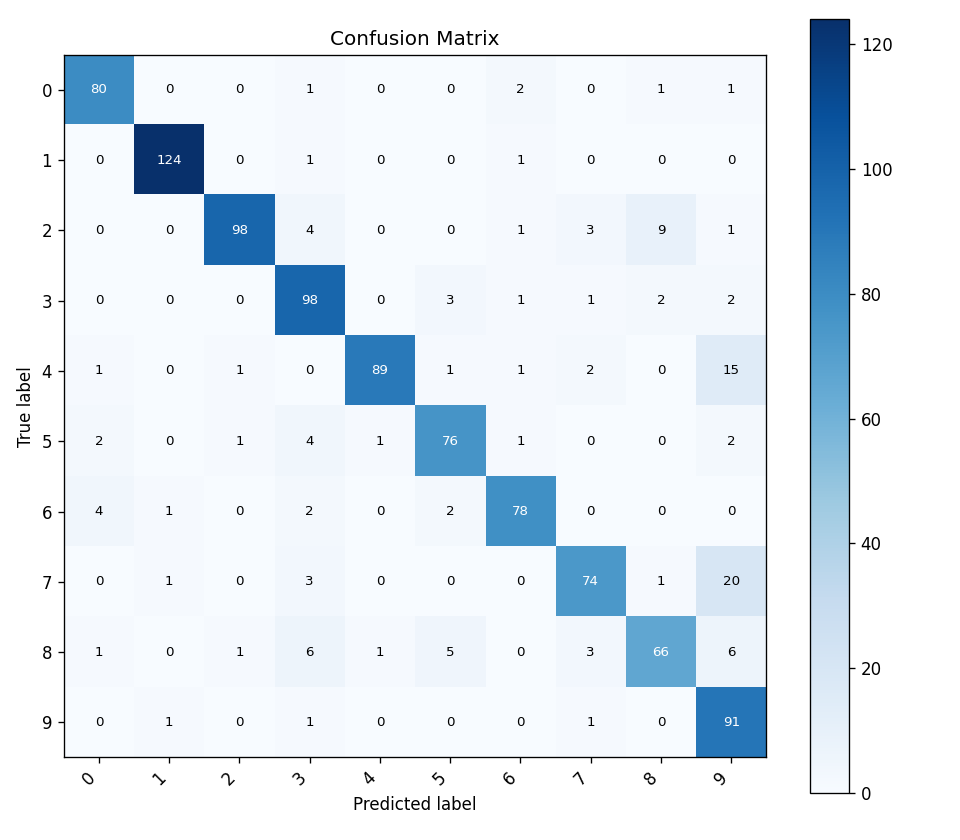
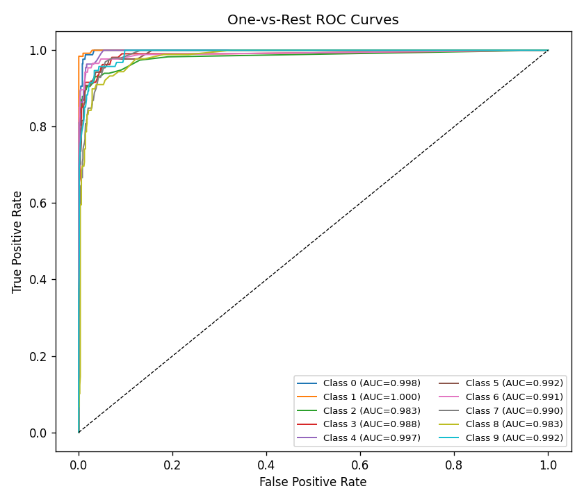
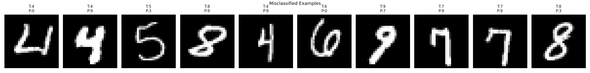
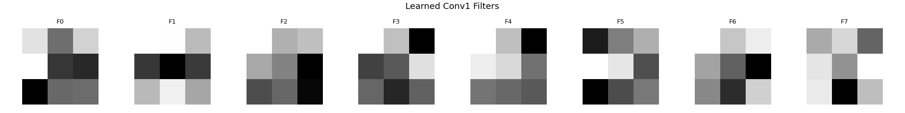

# Micro Neural Network

A neural network library built from scratch using only NumPy — no PyTorch, no TensorFlow.

Every component is hand-implemented: forward passes, backpropagation, optimizers, convolutional layers, and evaluation metrics.

---

## What's Built

| Component | Details |
|---|---|
| **Layers** | Dense, Conv2D (im2col), MaxPool2D, Flatten, BatchNorm, ReLU, Dropout |
| **Activations** | ReLU, Leaky ReLU, Sigmoid, Tanh, Softmax |
| **Loss Functions** | MSE, Cross-Entropy |
| **Optimizers** | SGD, Momentum, Adam |
| **Regularization** | L2, Dropout, Gradient Clipping (value & norm) |
| **LR Schedulers** | Step decay, Exponential, Time-based |
| **Data Augmentation** | Rotation, Shift, Zoom, Horizontal Flip |
| **Evaluation** | Confusion Matrix, Precision/Recall/F1, ROC/AUC, Filter Visualisation |

---

## Results on MNIST

Trained on **5,000 samples** for **10 epochs** using a 2-layer CNN built entirely from scratch.

- **Test Accuracy: 87.4%**
- **Macro AUC: 0.99**

### Confusion Matrix



The model performs strongly across all digits. The main confusion is between visually similar pairs — 7 vs 9 (20 errors) and 4 vs 9 (15 errors).

### ROC Curves (One-vs-Rest)



All 10 classes achieve AUC ≥ 0.98, with digit 1 hitting a perfect 1.000.

### Misclassified Examples



Seeing the actual wrong predictions reveals why — most misclassified digits are genuinely ambiguous even to the human eye.

### Learned Conv1 Filters



The first convolutional layer learns edge detectors and gradient patterns spontaneously — no supervision, just backpropagation.

---

## Project Structure

```
src/
├── layers.py        # Dense, Conv2D, MaxPool2D, Flatten, BatchNorm, ReLU
├── network.py       # Network class — forward, backward, update, train
├── loss.py          # MSE and Cross-Entropy
├── augmentation.py  # DataAugmentor — rotation, shift, zoom, flip
├── metrics.py       # Confusion matrix, F1, ROC/AUC, visualisation
└── utils.py         # LR schedulers, data utilities

examples/
├── xor_example.py          # XOR problem — sanity check
├── cnn_mnist_demo.py       # CNN training on MNIST
├── augmentation_demo.py    # Baseline vs augmented training comparison
├── evaluation_demo.py      # Full evaluation suite
├── batchnorm_demo.py       # BatchNorm vs no BatchNorm
├── clip_demo.py            # Gradient clipping comparison
└── gradient_check.py       # Numerical gradient verification
```

---

## Quick Start

```bash
pip install numpy scipy matplotlib
python examples/cnn_mnist_demo.py
```

---

## Architecture

```
Input (28×28×1)
    → Conv2D(1→8, 3×3, pad=1) → ReLU → MaxPool(2×2)
    → Conv2D(8→16, 3×3, pad=1) → ReLU → MaxPool(2×2)
    → Flatten
    → Dense(784→128, ReLU)
    → Dense(128→10, Softmax)
```
